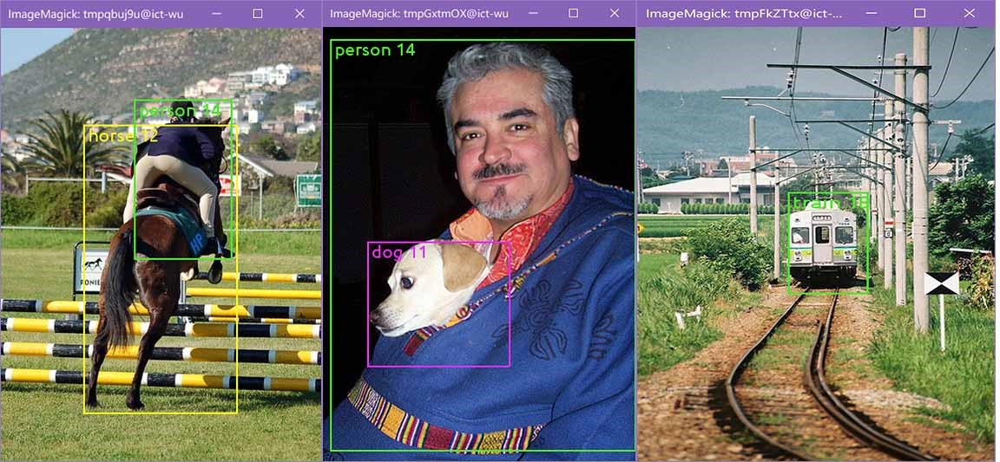

## For yolov2
#### YOLO Inference
```shell
python yolov2_show.py
```


#### Data preparation

```shell
cd data/Pascal_VOC
ln -s /your/path/to/VOCdevkit .
python get_list.py
# change related path in script 
./generate_lmdb.sh 
```


